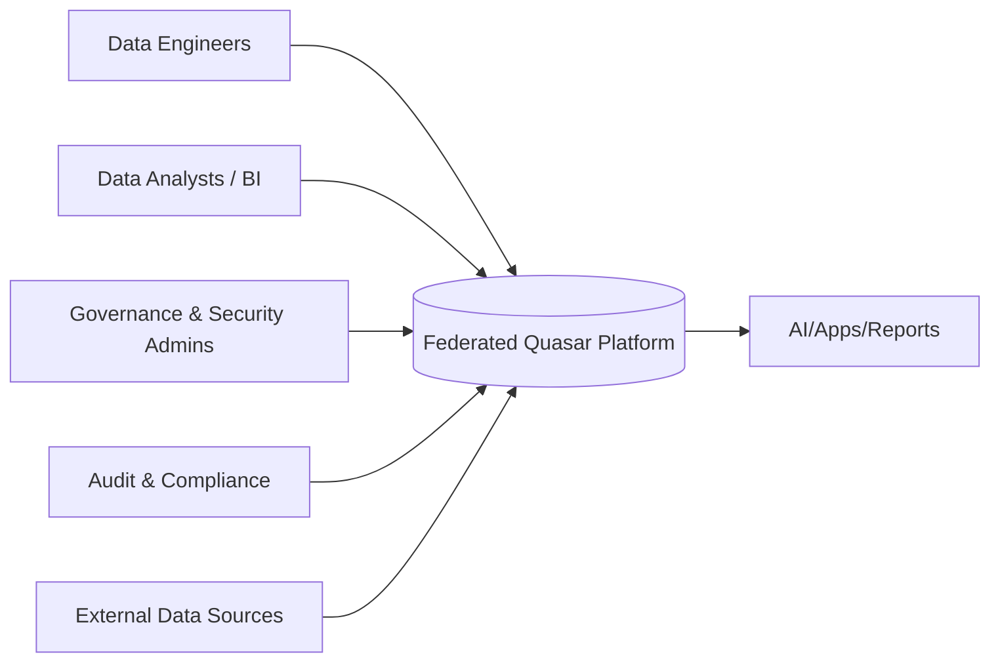
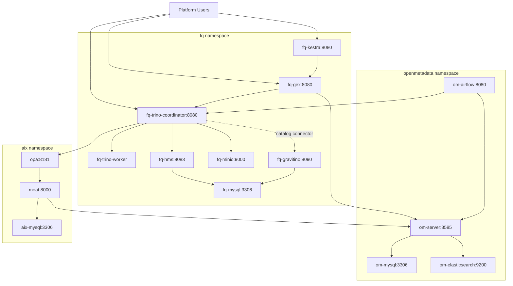
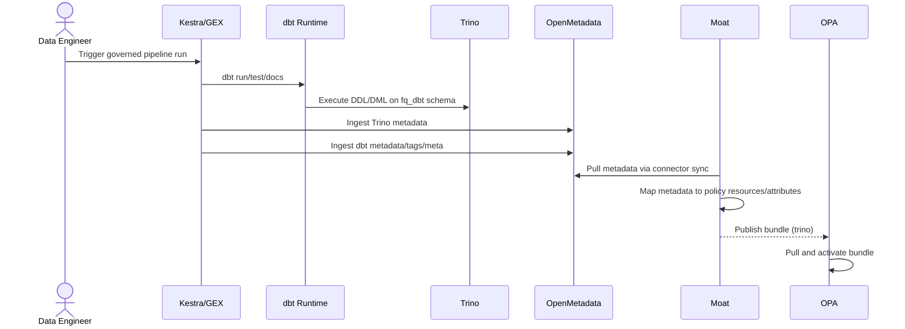
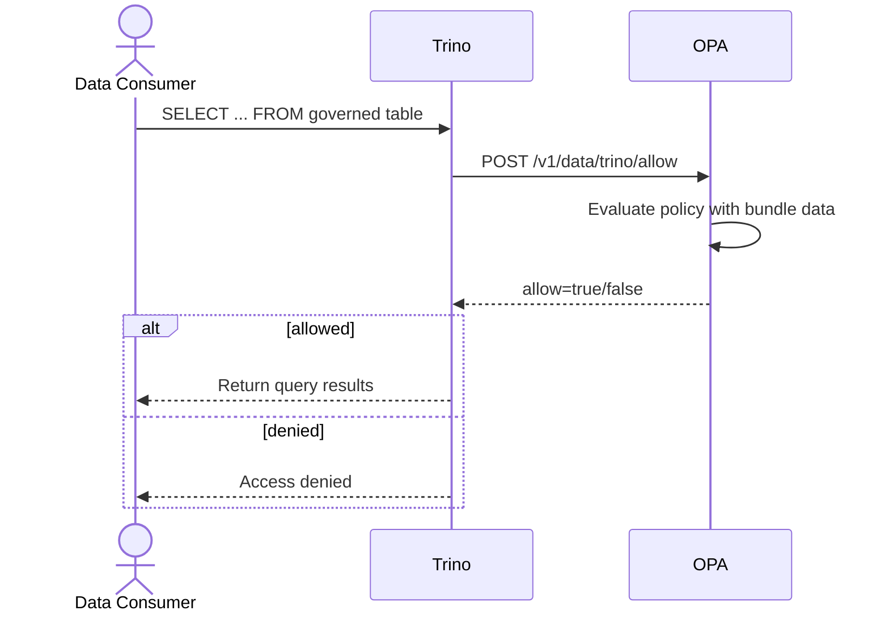

# Federated Quasar Unified Architecture Design (FQ + OM + AIX)

Last updated: 2026-03-17

This design consolidates the current architecture from:

- `ARCHITECTURE-VC-DECK.md`
- `ARCHITECTURE-OFFICIAL-README.md`
- `ARCHITECTURE-PODCAST-README.md`

And aligns it to current Kubernetes manifests under:

- `kube/components/fq`
- `kube/components/om`
- `kube/components/aix`

---

## 1. Scope and objective

Unify data execution (`fq`), metadata (`openmetadata`), and authorization governance (`aix`) into one operating model where:

1. Data is created and transformed.
2. Metadata is published and curated.
3. Policies are generated from metadata.
4. Access is enforced at query time.

Core platform path:

`SQL/dbt -> GEX/Kestra -> Trino -> OpenMetadata -> Moat -> OPA -> Trino`

---

## 2. L0 design (system context)

### L0 intent

At L0, Federated Quasar is a governed data platform consumed by engineers, analysts, and governance teams.

### L0 diagram



---

## 3. L1 design (domain decomposition)

### L1 domains

1. `fq` domain: data execution and orchestration.
2. `openmetadata` domain: metadata system of record and ingestion orchestration.
3. `aix` domain: policy intelligence and policy decisioning.

### L1 diagram

```mermaid
flowchart LR
  USER[Users and Services]

  subgraph FQ[fq namespace - Data Execution Plane]
    GEX[GEX]
    KES[Kestra]
    TRI[Trino]
  end

  subgraph OM[openmetadata namespace - Metadata Plane]
    OMS[OpenMetadata Server]
    OMA[OpenMetadata Ingestion (Airflow)]
  end

  subgraph AIX[aix namespace - Governance Plane]
    MOAT[Moat]
    OPA[OPA]
  end

  USER --> GEX
  USER --> KES
  USER --> TRI

  KES --> GEX
  GEX --> TRI
  GEX --> OMS
  OMA --> TRI
  OMA --> OMS

  OMS --> MOAT
  MOAT --> OPA
  TRI --> OPA
```

---

## 4. L2 design (container/service design)

### 4.1 `fq` namespace

| Service | Port / NodePort | Role | Key dependencies |
| --- | --- | --- | --- |
| `fq-gex` | `8080 / 30881` | UI + API for dbt run/test/docs and OM ingestion | `fq-trino`, `om-server` |
| `fq-kestra` | `8080 / 30882` | Workflow trigger/orchestration | `fq-gex` |
| `fq-trino` (`fq-trino-coordinator`) | `8080 / 30080` | Query engine and policy enforcement client | `fq-hms`, `fq-minio`, `fq-mysql`, `opa.aix` |
| `fq-trino-worker` | internal | Distributed query worker | `fq-trino` |
| `fq-hms` | `9083 / 30983` | Hive metastore endpoint | `fq-mysql` |
| `fq-minio` | `9000 / 30990` | S3 API for data lake I/O | PVC |
| `fq-minio-console` | `9001 / 30991` | MinIO admin console | `fq-minio` |
| `fq-mysql` | `3306 / 30336` | Operational DB for fq services | PVC |
| `fq-gravitino` | `8090 / 30090` | Catalog/governance connector endpoint | `fq-mysql`, MinIO |

### 4.2 `openmetadata` namespace

| Service | Port / NodePort | Role | Key dependencies |
| --- | --- | --- | --- |
| `om-server` | `8585 / 30585` | Metadata API + UI | `om-mysql`, `om-elasticsearch`, `om-airflow` |
| `om-server` admin | `8586 / 30586` | Admin endpoints | `om-server` |
| `om-airflow` | `8080 / 30808` | Metadata ingestion orchestration | `om-server`, `om-mysql`, `fq-trino` |
| `om-mysql` | `3306 / 30306` | OpenMetadata relational store | PV/PVC |
| `om-elasticsearch` | `9200 / 30920` | Search/index store | PV/PVC |
| `om-elasticsearch` transport | `9300 / 30930` | ES transport | `om-elasticsearch` |

### 4.3 `aix` namespace

| Service | Port / NodePort | Role | Key dependencies |
| --- | --- | --- | --- |
| `moat` | `8000 / 32080` | Metadata-to-policy mapping, bundle publishing, connectors | `mysql`, `om-server` |
| `opa` | `8181 / 32181` | Policy decision point for Trino | `moat` bundle endpoint |
| `mysql` | `3306 / 31306` | Moat persistence | `moat` |

### 4.4 L2 diagram



---

## 5. L3 design (runtime and policy design)

### 5.1 L3-A: governed data creation and publication

1. User triggers `fq-kestra` flow or directly calls `fq-gex`.
2. `fq-gex` runs dbt (`run/test/docs`) against `fq-trino`.
3. Trino materializes governed tables (`hms_db.fq_dbt.*`) via HMS + MinIO.
4. `fq-gex` ingests Trino technical metadata into `om-server`.
5. `fq-gex` ingests dbt artifacts/tags/meta into `om-server`.
6. Moat connector sync pulls metadata from OpenMetadata into Moat resources.
7. Moat generates OPA bundle.
8. OPA polls and activates latest bundle.



### 5.2 L3-B: query-time authorization

1. Consumer runs SQL in Trino.
2. Trino sends authorization input to OPA (`/v1/data/trino/allow`).
3. OPA evaluates Rego + bundle data sourced from Moat.
4. OPA returns allow/deny (and optional filters/masks if configured).
5. Trino executes or rejects query.



### 5.3 L3 policy and metadata contract

Metadata attributes used as policy input (current model):

- dbt tags: `domain:*`, `classification:*`, `access:*`
- dbt meta: owner team, classification, retention, policy intent
- OpenMetadata entity fields: tags, owners, domains, data products
- Moat resource attributes: normalized policy input records
- OPA input identity groups: evaluated against tag-derived rules

---

## 6. Non-functional design targets

1. Availability: independent scaling/rollout per namespace.
2. Security: network-policy segmentation and OPA as centralized PDP.
3. Traceability: run history in GEX/Kestra + metadata lineage in OM + policy state in Moat/OPA.
4. Extensibility: connector-driven metadata ingestion and Rego modularization (`classification`, `domain`, `access`).

---

## 7. Known reconciliation items (current-state deltas)

1. `aix` OPA ingress policy currently allows source from `default` namespace label `trino-coordinator`; fq runtime uses `fq` namespace and label `fq-trino-coordinator`.
2. `fq` Trino `gravitino.properties` uses `http://gravitino:8090`, while deployed service is `fq-gravitino`.
3. `dbt` model alias/table names and workflow filters are not fully aligned (`fq_orders_as_select2` vs workflow default `fq_orders_v2`).
4. Trino OPA config explicitly wires `allow` endpoint; row filter/column mask endpoints are defined in docs/policies but not explicitly configured in active `access-control.properties`.
5. Some docs still reference legacy `kube/components/aix/kubernetes/*` paths while manifests are under `kube/components/aix/*`.

These do not change the L0-L3 model, but should be resolved for a production baseline.

---

## 8. Lucid diagram artifacts

Lucid-importable Draw.io files (recommended for your current Lucid import settings):

- `docs/architecture/lucid/FQ-AIX-OM-L0.drawio`
- `docs/architecture/lucid/FQ-AIX-OM-L1.drawio`
- `docs/architecture/lucid/FQ-AIX-OM-L2.drawio`
- `docs/architecture/lucid/FQ-AIX-OM-L3-governed-flow.drawio`
- `docs/architecture/lucid/FQ-AIX-OM-L3-query-auth.drawio`
- `docs/architecture/lucid/FQ-AIX-OM-L0-L3-combined.drawio`

Mermaid sources (optional, for Mermaid-capable tools):

- `docs/architecture/lucid/FQ-AIX-OM-L0.mmd`
- `docs/architecture/lucid/FQ-AIX-OM-L1.mmd`
- `docs/architecture/lucid/FQ-AIX-OM-L2.mmd`
- `docs/architecture/lucid/FQ-AIX-OM-L3-governed-flow.mmd`
- `docs/architecture/lucid/FQ-AIX-OM-L3-query-auth.mmd`
- `docs/architecture/lucid/FQ-AIX-OM-L0-L3-combined.mmd`

CSV artifacts (node + edge data for Lucid data-linked diagrams):

- `docs/architecture/lucid/FQ-AIX-OM-nodes.csv`
- `docs/architecture/lucid/FQ-AIX-OM-edges.csv`

---

## 9. Recommended rollout by architecture level

1. L0: executive alignment on bounded context and outcomes.
2. L1: namespace ownership and team boundaries (`fq`, `openmetadata`, `aix`).
3. L2: service contract hardening (ports, DNS, policy, secrets, persistence).
4. L3: operational hardening of policy lifecycle, evidence generation, and failure handling.
